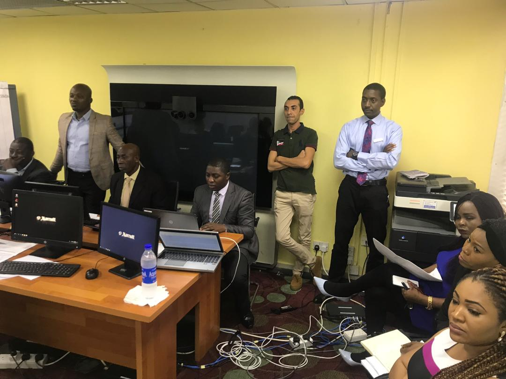

# Patrick D. Kolawole | IT Systems Manager

Experienced IT Systems Leader | Infrastructure & Network Security | Cloud Solutions Architect  
💼 10+ years transforming business operations through strategic IT management and cyber-resilience

---

## About Me
**Profile***

  
*Customer Focused, Experienced and Reliable IT Project delivery Agent*

As an accomplished IT Systems Manager, I specialize in designing, deploying, and optimizing secure and scalable infrastructure solutions across on-premise and cloud environments. My track record includes leading cross-functional teams, implementing ITIL-based service frameworks, and managing security posture for financial, hospitality, and enterprise environments.

---

## 🛠️ Core Skill Sets

- **Cloud Architecture & Migration**
- **Network Security & Firewall Administration**
- **Infrastructure & Network Administration**  
- **Microsoft 365 / Azure / Windows Server Management**  
- **Virtualization (VMware, Hyper-V)**  
- **Cloud Architecture & Migration**  
- **ITIL, Service Desk & Incident Management**  
- **Cybersecurity & Endpoint Protection**  
- **Disaster Recovery Planning & BCP**  
- **Firewall / VPN / IDS Configuration**

---

## 📌 Featured Projects

### 🔐 Marriott Secure Converged Network Transformation Project

Migrated legacy infrastructure(Servers, distribution switches, fiber optic backbone links etc.) to a hybrid cloud (Marriott private cloud + On-prem). converted flat hotel LAN infrastructre design to a Converged and secure network with VLANS etc. Implemented Cisco ASA firewall within Marriott international network.

**Project Screenshots:**

  
*Latest HP servers Firewall installed and configured*

  
*Training and Project planning Conference room*

---

### 🏨 Hospitality IT Revamp

Deployed end-to-end property management systems (PMS, POS, VoIP). Reduced support tickets by 30% via automated Helpdesk.

**Project Screenshots:**

  
*Property Management System Dashboard*

  
*IT Helpdesk & Self-Service Portal Interface*

---

### 🔐 Secure Converged Network Transformation Project

Migrated legacy infrastructure to a hybrid cloud (Azure + On-prem). Implemented Fortinet perimeter security and achieved 99.98% uptime.

**Project Screenshots:**

  
*Fortinet Edge Firewall Console*

  
*Hybrid Cloud Deployment Diagram*

---

## 📚 Certifications

- Google Cybersecurity Professional Certificate 
- ISC2 Cybersecurity Certificate (CC) 
- Microsoft Certified: Solutions Expert (MCSE)   
- Oracle Database 11G Certified professional (OCP)   
- CompTIA Security+  
- Cisco CCNA
- IBM Customer Engagement: Problem Solving and process Controls Certificate 

---

## 📫 Contact

📧 patrickd.kolawole@yahoo.com  
🌐 linkedin.com: http://ng.linkedin.com/in/PatrickDKolawole  
🐙 GitHub: [github.com/pakolawole25](https://github.com/pakolawole25)

---
