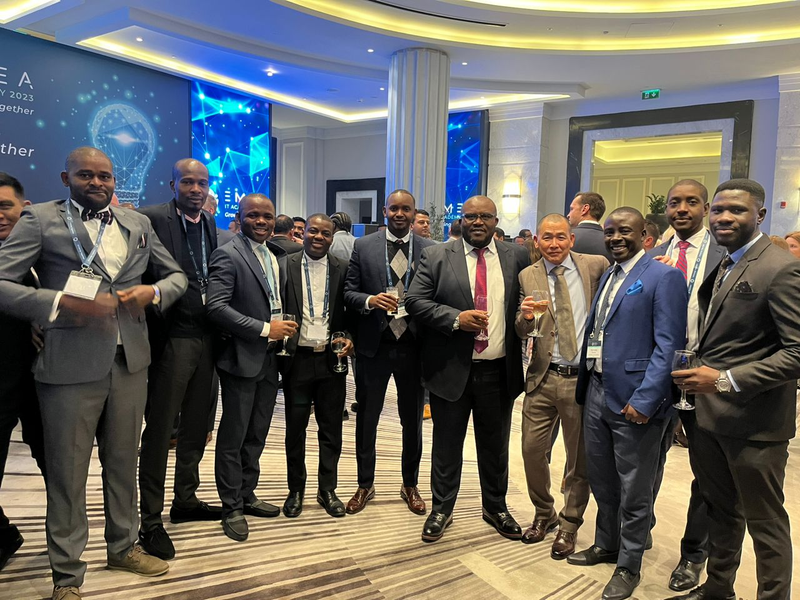
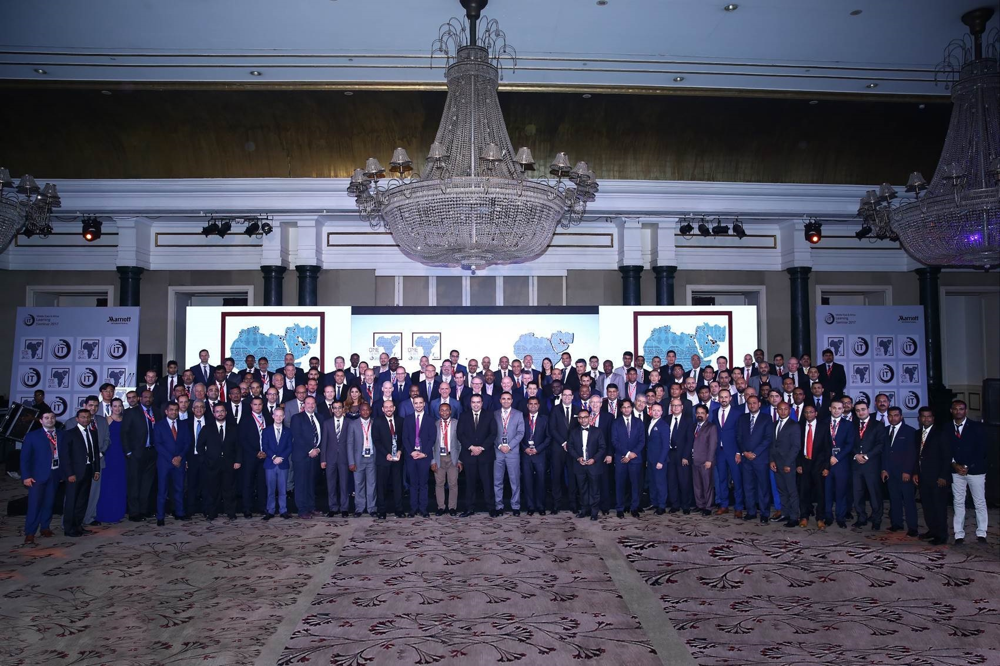
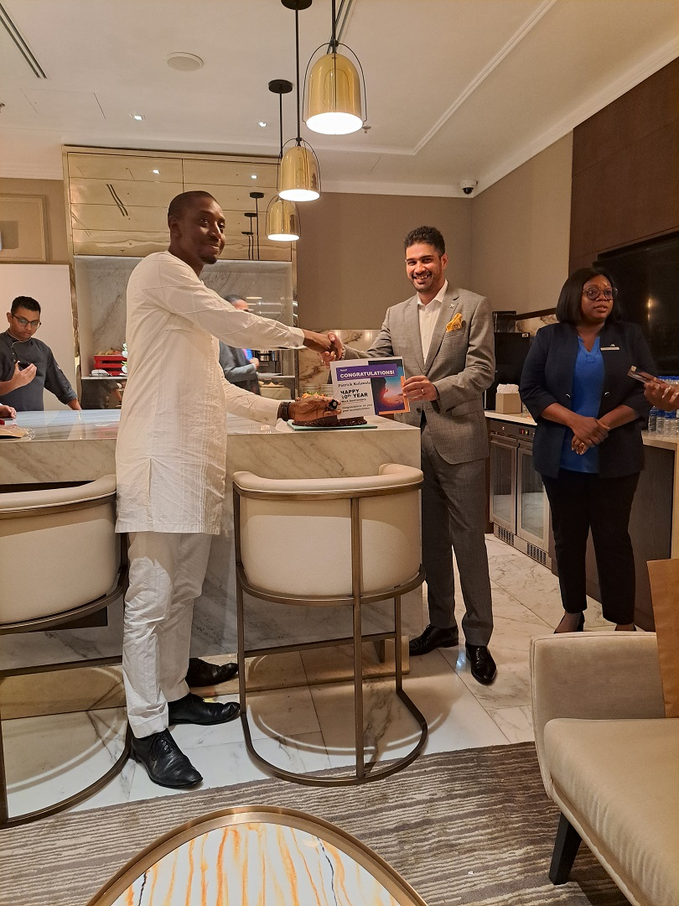

# Patrick D. Kolawole | IT Systems Manager

Experienced IT Systems Leader | Infrastructure & Network Security | Cloud and AI Solutions   
💼 10+ years transforming business operations through strategic IT management and cyber-resilience

---

## About Me
**Profile***

*Customer Focused, Experienced and Reliable IT Project delivery Agent*

As an accomplished IT Systems Manager, I specialize in designing, deploying, and optimizing secure and scalable infrastructure solutions across on-premise and cloud environments. My track record includes leading cross-functional teams, implementing ITIL-based service frameworks, and managing security posture for financial, hospitality, and enterprise environments.

---

## 🛠️ Core Skill Sets

- **Cloud Architecture & Migration**
- **Network Security & Firewall Administration**
- **Infrastructure & Network Administration**  
- **Microsoft 365 / Azure / Windows Server Management**  
- **Virtualization (VMware, Hyper-V)**  
- **Cloud Architecture & Migration**  
- **ITIL, Service Desk & Incident Management**  
- **Cybersecurity & Endpoint Protection**  
- **Disaster Recovery Planning & BCP**  
- **Firewall / VPN / IDS Configuration**

---

## 📌 Featured Projects

### 🔐 Marriott Secure Converged Network Transformation and integration with Starwood Global network Active Directory - Project

Project Overview:
Led the secure transformation and integration of Marriott’s legacy IT infrastructure with Starwood’s global network. Re-architected flat LANs into segmented VLANs, integrated Active Directory domains, and deployed Cisco ASA for firewall protection. Delivered a resilient hybrid cloud (on-prem + Marriott private cloud) while ensuring compliance, availability, and secure access across departments.

**Project Screenshots:**

  
*Latest HP servers Firewall installed and configured with VLANs and other new security features*

  
*Training and Project planning Conference room*

---

### 🏨 Hospitality IT Infrastructure Revamp

Redesigned and upgraded core hospitality systems and infrastructure across multiple sites. Deployed enterprise-grade PMS, VoIP, POS, and PABX systems to streamline operations. Automated incident management with ServiceNow, reducing support load by 30%. Upgraded network backbone with high-availability fiber, new-generation switches, and scalable Wi-Fi coverage.

**Project Screenshots:**

  
*Property Core Network Revamp including fiber optic backbone upgrade, WIFI cloud Upgrade, Servers and distribution switches upgrade*

  
*Training and Project planning Conference room*

---

### 🔐 Secure Converged Network Transformation Project
Project Overview:
Directed the migration of on-premise systems to a secure hybrid cloud model. Integrated Fortinet next-gen firewalls, redefined uptime SLAs, and applied governance policies. Key workloads and applications were rehosted to achieve 99.98% uptime while enhancing data protection, compliance, and remote accessibility.
**Project Screenshots:**

  
*Fortinet Edge Firewall Console*

  
*Hybrid Cloud Deployment Diagram*

---

## 🏆 Awards & Achievements

*10Years of Excellence Award at Marriott delivered by Area Senior IT manager and General Manager*
- 🛡️ **Zero Downtime Champion** – 99.999% uptime achieved for mission-critical enterprise apps

  

## 📚 Certifications

- Google Cybersecurity Professional Certificate 
- ISC2 Cybersecurity Certificate (CC) 
- Microsoft Certified: Solutions Expert (MCSE)   
- Oracle Database 11G Certified professional (OCP)   
- CompTIA Security+  
- Cisco CCNA
- IBM Customer Engagement: Problem Solving and process Controls Certificate 

---

## 📫 Contact

📧 patrickd.kolawole@yahoo.com  
🌐 linkedin.com: http://ng.linkedin.com/in/PatrickDKolawole  
🐙 GitHub: [github.com/pakolawole25](https://github.com/pakolawole25)

---
